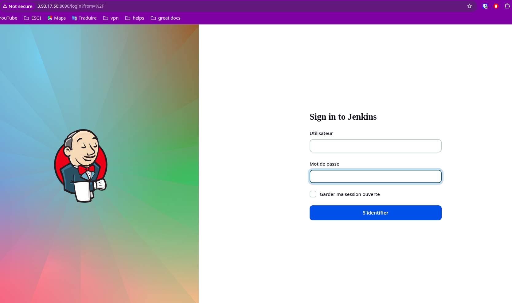
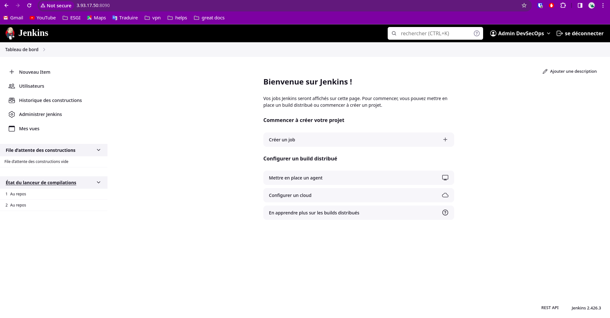

# Installation de Jenkins

* Etapes d'installation here: https://esgi.gitbook.io/devsecops/readme/configuration-de-la-vm/installation-de-jenkins

* Access à l'interface de jenkins après deploiement

    * Interface de login
    

    * Dashboard Jenkins
    
