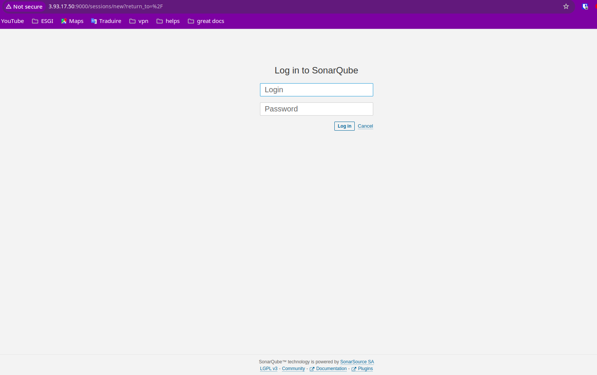
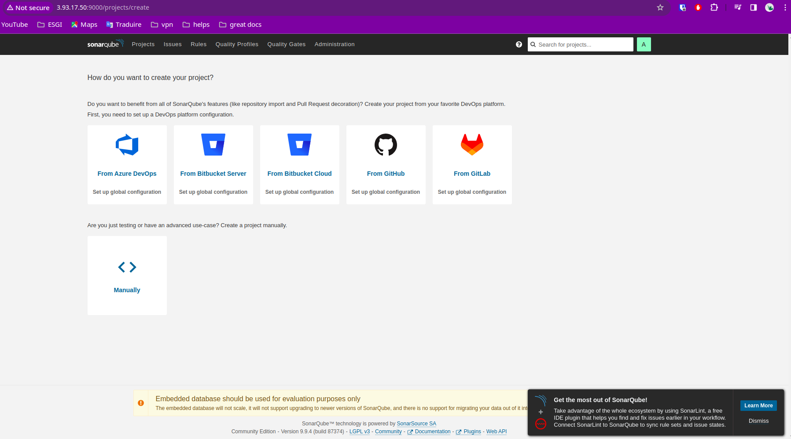

# Installation de Sonarqube


* Etape d'installation: https://esgi.gitbook.io/devsecops/readme/configuration-de-la-vm/installation-de-sonarqube

* Validation de l'installation
    * Show du container
    ```console
    ubuntu@ip-10-0-1-61:~$ docker ps -a
    CONTAINER ID   IMAGE                     COMMAND                  CREATED        STATUS         PORTS                                       NAMES
    7c60e8595167   sonarqube:lts-community   "/opt/sonarqube/dock…"   19 hours ago   Up 3 seconds   0.0.0.0:9000->9000/tcp, :::9000->9000/tcp   sonar
    ubuntu@ip-10-0-1-61:~$ 
    ```

    * Accès au dashboard sonarqube
    
    

